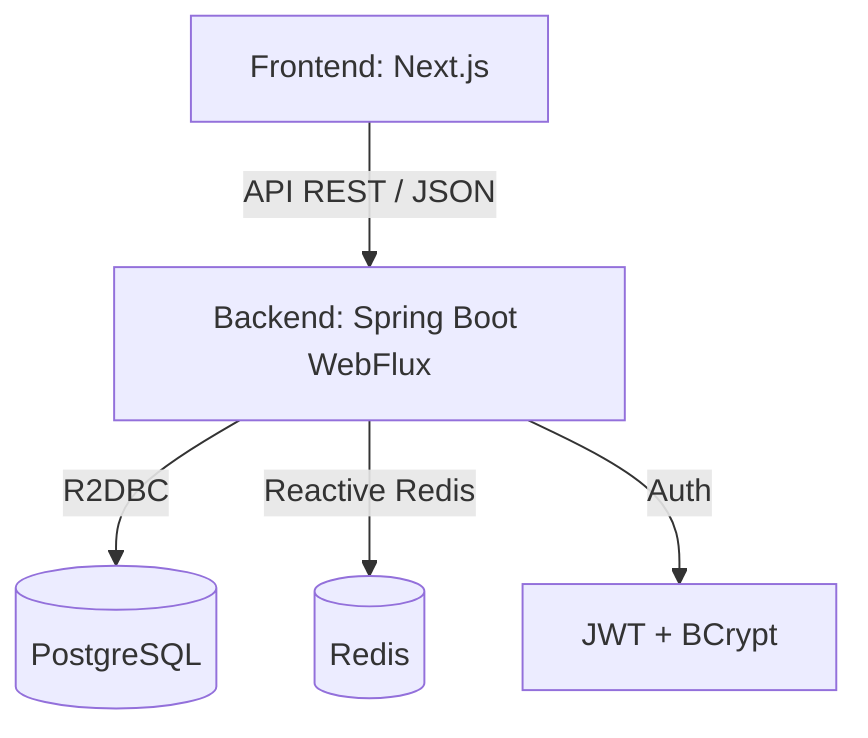

# 🌐 SchoolLink

**SchoolLink** est une plateforme de mise en relation contextuelle conçue pour dynamiser la vie estudiantine. Elle permet aux étudiants de se connecter en fonction de leurs intérêts, de leurs filières et de participer à des événements organisés par les associations (BDE) ou l'administration.

---

## 🏗️ Architecture Globale

Le projet suit une architecture **Client-Serveur** moderne, découplée et entièrement conteneurisée.



---

## ⚙️ Backend Architecture

Le backend est un **Monolithe Modulaire** réactif construit avec **Spring Boot 3.2.5**.

### Stack Technique
- **Core** : Java 17, Spring WebFlux (Netty)
- **Persistence** : R2DBC (PostgreSQL réactif)
- **Cache** : Redis (Lettuce réactif)
- **Sécurité** : Spring Security, JWT (jjwt)
- **Documentation** : SpringDoc OpenAPI (Swagger)
- **Utilitaires** : Lombok, MapStruct

### Points Clés
- **Modulaire** : Découpé en modules fonctionnels (`matching`, `events`, `governance`, `profile`).
- **Performance** : Utilisation de flux asynchrones (Project Reactor) pour une haute scalabilité.
- **Ingestion Automatique** : Pipeline d'importation de données (CSV/JSON/ICS) au démarrage.

---

## 🎨 Frontend Architecture

Le frontend est une application SPA/SSR moderne construite avec **Next.js 16**.

### Stack Technique
- **Framework** : React 19, Next.js (App Router)
- **Styling** : Tailwind CSS 4.0
- **Icons** : Lucide React
- **API Client** : Client TypeScript auto-généré via OpenAPI Generator.
- **State Management** : React Context + Hooks.

### Points Clés
- **Typage Fort** : Intégration complète de TypeScript avec les modèles du backend.
- **UX Dynamique** : Sidebar de découverte, suggestions personnalisées et formulaires d'onboarding fluides.
- **Responsive Design** : Interface optimisée pour mobile et desktop.

---

## 🚀 Installation et Démarrage

### Prérequis
- Docker & Docker Compose
- Node.js 20+
- JDK 17+

### Lancement avec Docker (Recommandé)
```bash
docker-compose up --build
```
Le backend sera accessible sur `http://localhost:8080` et le frontend sur `http://localhost:3000`.

### Accès Swagger (API Docs)
Une fois le backend lancé : `http://localhost:8080/swagger-ui.html`

---

## 🌍 Déploiement
- **Backend** : Déployé sur **Render** (via Docker).
- **Base de données** : PostgreSQL managée sur Render.
- **Frontend** : Compatible Vercel / Render.
